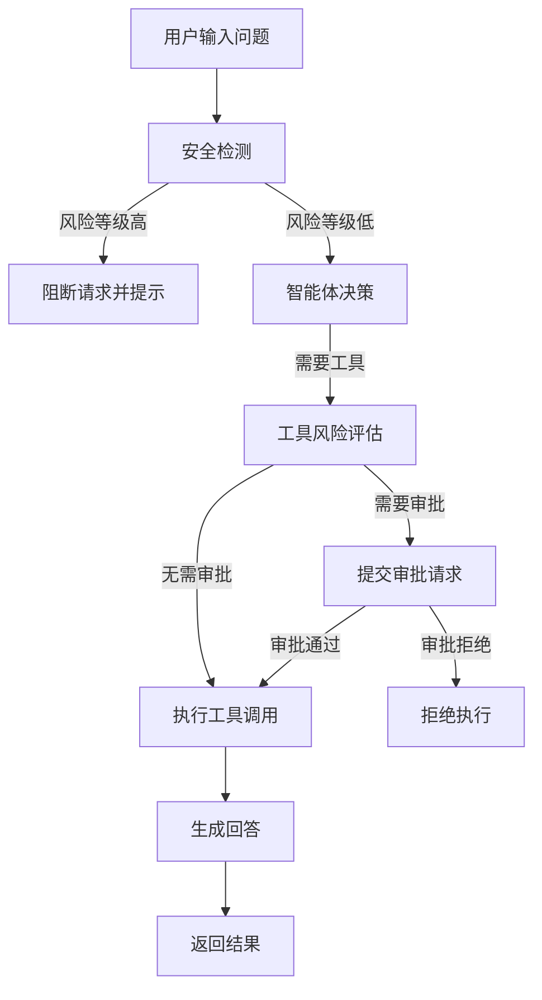
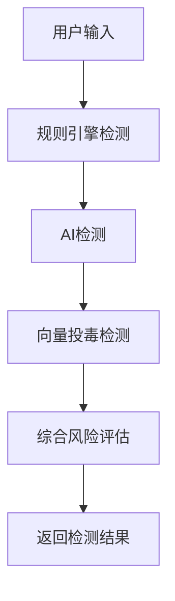

# 政企大模型智能体安全系统 - 前端产品需求文档

## 1. 产品概述
面向政企场景的大模型智能体安全系统前端界面，为用户提供安全智能问答、风险检测、工具调用审批、插件扫描等一站式安全服务。系统由传统问答演进为具备检索、记忆、工具调用、文件处理、跨系统联动和自动执行能力的智能体系统。

- **目标用户**: 政企工作人员、安全管理员、系统运维人员
- **核心价值**: 提供安全可靠的AI智能体服务，确保政企场景下的大模型应用安全可控

## 2. 核心功能

### 2.1 用户角色
| 角色 | 核心权限 |
|------|----------|
| 普通用户 | 使用智能问答、输入安全检测、查看基础审计日志 |
| 安全管理员 | 工具调用审批、插件安全扫描、查看完整审计日志 |

### 2.2 功能模块
1. **智能问答中心**: AI智能体对话界面，支持多轮对话、工具调用、文件上传
2. **安全检测中心**: 输入攻击检测、工具风险评估、插件安全扫描
3. **审批管理中心**: 审批流程管理、审批记录查询
4. **审计日志中心**: 操作日志、安全事件日志、统计分析
5. **系统监控中心**: 服务状态监控、性能指标展示

### 2.3 页面详情

| 页面名称 | 模块名称 | 功能描述 |
|----------|----------|----------|
| 智能问答中心 | 对话面板 | 与AI智能体进行自然语言交互，支持多轮对话、流式响应 |
| 智能问答中心 | 工具调用面板 | 展示当前对话中使用的工具及执行结果 |
| 智能问答中心 | 文件上传面板 | 支持上传文件进行处理和分析 |
| 安全检测中心 | 输入检测模块 | 实时检测输入内容是否包含攻击特征 |
| 安全检测中心 | 工具风险评估模块 | 评估工具调用的风险等级 |
| 安全检测中心 | 插件扫描模块 | 扫描插件代码的安全性 |
| 审批管理中心 | 审批列表 | 查看待审批和已审批的请求 |
| 审批管理中心 | 审批详情 | 查看审批请求详情并进行操作 |
| 审计日志中心 | 日志列表 | 查看系统操作日志 |
| 审计日志中心 | 日志搜索 | 按条件搜索日志 |
| 系统监控中心 | 状态监控 | 展示服务健康状态 |
| 系统监控中心 | 统计分析 | 安全检测统计、风险趋势分析 |

## 3. 核心流程

### 3.1 智能问答流程

### 3.2 安全检测流程

## 4. 用户界面设计

### 4.1 设计风格
- **主色调**: 深蓝色系（#1a365d），代表专业、安全、可信
- **辅助色**: 科技蓝（#3182ce）、安全绿（#38a169）、警告橙（#dd6b20）、危险红（#e53e3e）
- **按钮风格**: 圆角矩形，渐变背景，悬浮效果
- **字体**: 思源黑体，标题加粗，正文字号适中
- **布局风格**: 侧边栏导航 + 主内容区，卡片式布局
- **图标风格**: Lucide图标，简洁现代

### 4.2 页面设计概览

| 页面名称 | 模块名称 | UI元素 |
|----------|----------|--------|
| 智能问答中心 | 对话面板 | 消息气泡、输入框、发送按钮、附件上传 |
| 智能问答中心 | 工具调用面板 | 工具卡片、执行状态、结果展示 |
| 安全检测中心 | 输入检测模块 | 输入框、风险等级标签、检测结果列表 |
| 安全检测中心 | 工具风险评估模块 | 工具选择、参数配置、风险评分展示 |
| 审批管理中心 | 审批列表 | 表格、筛选器、操作按钮 |
| 审计日志中心 | 日志列表 | 表格、搜索框、分页器 |
| 系统监控中心 | 状态监控 | 状态卡片、仪表盘、图表 |

### 4.3 响应性设计
- **桌面端**: 侧边栏固定，主内容区自适应
- **平板端**: 侧边栏可折叠
- **移动端**: 侧边栏转为底部导航

### 4.4 交互设计
- **对话流式响应**: 打字机效果展示AI回复
- **风险等级动态展示**: 根据风险等级变化颜色和图标
- **工具调用动画**: 展示工具执行进度
- **审批状态实时更新**: 审批操作后即时反馈