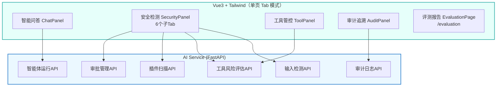

# 政企大模型智能体安全系统 - 前端技术架构文档

> 更新说明（2026-08-23）：本文档已全量同步当前代码实际状态（架构/技术栈/路由/API/项目结构/状态管理/数据模型/样式）。早期版本描述的"多路由中心"模式（ChatCenter/SecurityCenter/ApprovalCenter/AuditCenter/MonitorCenter 独立路由页）已在重构中演进为"单页 Tab"模式。

## 1. 架构设计



前端为单页应用：主控制台 `/`（HomePage，侧边栏导航切换 4 大 Tab）+ 评测报告 `/evaluation`（独立路由页）。审批管理不再是独立页面，收纳于安全检测 Tab 的"审批管理"子 Tab。

## 2. 技术描述

- **前端框架**: Vue 3.4 + TypeScript 5.3
- **UI方案**: 自研组件 + TailwindCSS 3.4（无 Element Plus）
- **构建工具**: Vite 5.x
- **状态管理**: 无全局状态库（无 Pinia），组件自管理 + composables（useToast/useWebSocket）
- **路由管理**: Vue Router 4.4
- **HTTP客户端**: Axios 1.x（全局拦截器统一鉴权与错误反馈，见 main.ts）
- **图标库**: Lucide Vue Next 0.5.x
- **图表库**: ECharts 6.1 + vue-echarts 8
- **样式工具**: clsx + tailwind-merge
- **后端API**: FastAPI (http://localhost:8080)，dev 模式经 Vite 代理（`/api` 直转、`/ai` 重写为 `/api`、`/ws` WebSocket 转发，见 vite.config.ts）

## 3. 路由定义

路由数组显式标注 `RouteRecordRaw[]`（规范见前端设计文档 9.4 节）。

### 3.1 路由表

| 路由 | 组件 | 页面名称 | 加载方式 |
|------|------|----------|---------|
| `/` | pages/HomePage.vue | 主控制台（4 大 Tab） | 懒加载 |
| `/evaluation` | pages/EvaluationPage.vue | 评测报告 | 懒加载 |
| `/:pathMatch(.*)*` | — | 兜底：重定向 `/` | 防未知路径白屏 |

### 3.2 HomePage 内部 Tab（组件状态切换，非路由）

| Tab | 组件 | 功能 |
|-----|------|------|
| chat | ChatPanel.vue | 智能问答（会话管理/文件上传/消息撤回） |
| security | SecurityPanel.vue | 安全检测 |
| tools | ToolPanel.vue | 工具管控（5 工具卡片/风险查询） |
| audit | AuditPanel.vue | 审计追溯（日志分页/链验签/导出） |

### 3.3 SecurityPanel 子 Tab

| 子 Tab | 功能 |
|--------|------|
| detect | 输入检测（单条/文件） |
| plugin | 插件检测（供应链扫描） |
| approval | 审批管理（待审批列表/批准/驳回，WebSocket 实时更新） |
| kb_poisoning | 知识库投毒检测（PDF） |
| risk_profile | 会话风险画像 |
| bypass | 对抗测试（变异策略） |

## 4. API定义

### 4.1 智能体运行API
- **POST** `/api/agent/run`
- **参数**: `user_input` (string), `input_source` (string)
- **响应**: 
```typescript
interface AgentRunResponse {
  final_response: string
  risk_level: string
  can_proceed: boolean
  current_step: string
  detection_results: DetectionResult[]
  tool_risk_results: ToolRiskResult[]
  llm_response: string
}
```

### 4.2 输入检测API
- **POST** `/api/security/detect_single`
- **参数**: `text` (string), `source` (string)
- **响应**: 
```typescript
interface DetectionResult {
  risk_level: string
  attack_type: string | null
  confidence: number
  evidence: string[]
  source: string
  processed_text: string
}
```

### 4.3 工具风险评估API
- **POST** `/api/security/tool_risk`
- **请求体**: 
```typescript
interface ToolCallRequest {
  tool_name: string
  tool_args: Record<string, any>
  user_role: string
  agent_id: string
}
```
- **响应**: 
```typescript
interface ToolRiskResult {
  risk_level: string
  risk_score: number
  risk_details: string[]
  requires_approval: boolean
  approval_level: string | null
}
```

### 4.4 插件扫描API
- **POST** `/api/security/plugin_scan`
- **请求体**: 
```typescript
interface PluginScanRequest {
  plugin_name: string
  plugin_version: string
  code_content: string
}
```
- **响应**: 
```typescript
interface PluginScanResult {
  plugin_name: string
  plugin_version: string
  is_safe: boolean
  safety_score: number
  vulnerabilities: Vulnerability[]
}
```

### 4.5 审批管理API
- **POST** `/api/security/approval/create`
- **POST** `/api/security/approval/approve`（body 传参版）
- **POST** `/api/security/approval/reject`（body 传参版）
- **GET** `/api/security/approval/pending`（前端审批列表；注意必须注册在 `/{request_id}` 之前，否则被路径参数遮蔽）
- **GET** `/api/security/approval/{request_id}`
- **GET** `/api/security/approval/status/{request_id}`
- **POST** `/api/security/approval/approve/{request_id}`（前端批准按钮；批准时联动授予能力令牌 + 会话解锁）
- **POST** `/api/security/approval/reject/{request_id}`（前端驳回按钮）

### 4.6 审计日志API
- **GET** `/api/audit/logs/recent`
- **POST** `/api/audit/logs/search`
- **GET** `/api/audit/logs/{log_id}`

### 4.7 健康检查API
- **GET** `/api/health`

## 5. 项目结构

```
frontend/
├── src/
│   ├── pages/                    # 路由页面（2 个）
│   │   ├── HomePage.vue          #   / 主控制台（侧边栏 + 4 大 Tab 容器）
│   │   └── EvaluationPage.vue    #   /evaluation 评测报告
│   ├── components/
│   │   ├── chat/
│   │   │   └── ChatPanel.vue     # 智能问答（会话/消息/文件上传/撤回）
│   │   ├── security/
│   │   │   └── SecurityPanel.vue # 安全检测（6 个子 Tab）
│   │   ├── tools/
│   │   │   └── ToolPanel.vue     # 工具管控（工具卡片/风险评估）
│   │   ├── audit/
│   │   │   └── AuditPanel.vue    # 审计追溯（日志/验签/导出）
│   │   └── ToastContainer.vue    # 全局 Toast 通知
│   ├── composables/
│   │   ├── useToast.ts           # Toast 通知（全局单例）
│   │   └── useWebSocket.ts       # WebSocket（审批更新/风险告警订阅）
│   ├── router/
│   │   └── index.ts              # 路由定义（RouteRecordRaw[] + catch-all 兜底）
│   ├── App.vue                   # 根组件（路由过渡动画）
│   ├── main.ts                   # 入口（axios 拦截器/全局错误处理器）
│   └── style.css                 # 全局样式（CSS 变量/Tailwind 指令）
├── index.html
├── package.json
├── vite.config.ts                # 构建配置（分包/代理：/api /ai /ws）
├── tsconfig.json
├── tailwind.config.js
└── postcss.config.js
```

## 6. 状态管理

本项目**不使用全局状态库**（无 Pinia/Vuex），状态分两层：

### 6.1 组件内部状态（ref/reactive）

各面板自管理业务状态，如 ChatPanel 内部的会话列表、消息流、加载态；SecurityPanel 内部的子 Tab 切换、待审批列表等。跨组件无共享需求，避免全局状态库的额外复杂度。

### 6.2 全局单例 composables

| composable | 机制 | 用途 |
|------------|------|------|
| useToast.ts | 模块级单例数组 + 响应式 | 全局 Toast 通知（main.ts 拦截器与各组件共用） |
| useWebSocket.ts | 模块级单例连接 | WebSocket 连接管理与事件订阅（`approval_update`/`risk_alert` 等） |

## 7. 数据模型

### 7.1 风险等级
```typescript
enum RiskLevel {
  NONE = 'none',
  LOW = 'low',
  MEDIUM = 'medium',
  HIGH = 'high',
  CRITICAL = 'critical'
}
```

### 7.2 攻击类型

来源：`ai_service/models/schemas.py` 的 `AttackType`（27 类，与后端检测规则一一对应）。前端仅作展示，不维护独立枚举。

**基础注入类（8）**

```typescript
enum AttackType {
  PROMPT_INJECTION = 'prompt_injection'          // 提示词注入
  JAILBREAK = 'jailbreak'                        // 越狱/角色伪装
  SQL_INJECTION = 'sql_injection'                // SQL 注入
  XSS = 'xss'                                    // 跨站脚本
  COMMAND_EXECUTION = 'command_execution'        // 命令执行（含变形混淆）
  PATH_TRAVERSAL = 'path_traversal'              // 路径遍历
  CRLF_INJECTION = 'crlf_injection'              // CRLF 注入
  JSON_INJECTION = 'json_injection'              // JSON 注入
}
```

**数据安全类（5）**

```typescript
enum AttackType {
  DATA_LEAKAGE = 'data_leakage'                  // 数据泄露
  DATA_POISONING = 'data_poisoning'              // 知识库投毒
  MEMORY_POISONING = 'memory_poisoning'          // 记忆投毒
  CONTEXT_POISONING = 'context_poisoning'        // 上下文投毒
  DATA_EXFILTRATION = 'data_exfiltration'        // 数据外传
}
```

**间接/隐写类（6）**

```typescript
enum AttackType {
  INDIRECT_INJECTION = 'indirect_injection'                // 间接注入
  STEGANOGRAPHY = 'steganography'                          // 隐写术
  HIDDEN_TEXT_STEGANOGRAPHY = 'hidden_text_steganography'  // 隐藏文本隐写
  DOCUMENT_EMBEDDED_INJECTION = 'document_embedded_injection' // 文档嵌入注入
  WEB_CONTENT_INJECTION = 'web_content_injection'          // 网页内容注入
  MARKDOWN_INJECTION = 'markdown_injection'                // Markdown 注入
}
```

**供应链/工具类（4，对应创新点 MCP/Skill 扫描）**

```typescript
enum AttackType {
  MCP_POISONING = 'mcp_poisoning'                        // MCP 投毒
  SKILL_TAMPERING = 'skill_tampering'                    // Skill 篡改
  TOOL_DESCRIPTOR_POISONING = 'tool_descriptor_poisoning' // 工具描述符投毒
  COMBINED_ATTACK = 'combined_attack'                    // 组合攻击
}
```

**其他（4）**

```typescript
enum AttackType {
  UNAUTHORIZED_ACCESS = 'unauthorized_access'    // 越权访问
  CONTENT_INJECTION = 'content_injection'        // 内容注入（含伪紧急通知）
  NETWORK_ATTACK = 'network_attack'              // 网络攻击
  MACRO_INJECTION = 'macro_injection'            // 宏注入
  DDE_INJECTION = 'dde_injection'                // DDE 注入
}
```

> 完整攻击样本库与检出情况见检测基线报告（第 7 轮，335 样本 / 29 类）。

## 8. 样式设计

深色主题（安全运营中心风格），与 [前端设计文档](file:///x:/ZuoYe/揭榜挂帅26/Gov-Com-safeagent/frontend/前端设计文档.md) 第 2 章色板一致。

### 8.1 颜色变量

来源 `src/style.css`，经 Tailwind 扩展后可直接用类名（`bg-surface`、`text-muted`、`border-default` 等）：

```css
:root {
  /* 背景（三层递进） */
  --bg-base: #0B1120;      /* 页面底 */
  --bg-surface: #111827;   /* 卡片/面板 */
  --bg-elevated: #1E293B;  /* 弹出层/高亮区 */
  --bg-hover: #334155;     /* 悬停态 */

  /* 文字 */
  --text-primary: #E2E8F0;   /* 主文字 */
  --text-secondary: #94A3B8; /* 次级文字 */
  --text-muted: #64748B;     /* 弱化文字 */
  --text-disabled: #475569;  /* 禁用态 */

  /* 边框 */
  --border-default: #1E293B;
  --border-hover: #334155;
  --border-active: #06B6D4;  /* 激活强调（青色） */

  /* 语义色（风险等级映射） */
  --color-safe: #10B981;     /* 无风险 */
  --color-low: #3B82F6;      /* low */
  --color-medium: #F59E0B;   /* medium */
  --color-high: #F97316;     /* high */
  --color-critical: #EF4444; /* critical */
  --color-accent: #06B6D4;   /* 品牌强调色 */
}
```

### 8.2 响应式断点
```css
@media (max-width: 640px) { ... }  /* 移动端 */
@media (max-width: 768px) { ... }  /* 平板端 */
@media (min-width: 1024px) { ... } /* 桌面端 */
```