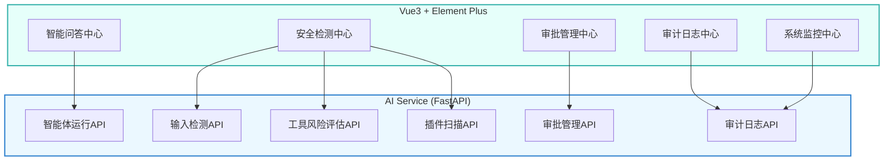

# 政企大模型智能体安全系统 - 前端技术架构文档

## 1. 架构设计



## 2. 技术描述

- **前端框架**: Vue 3.4 + TypeScript
- **UI组件库**: Element Plus 2.5
- **构建工具**: Vite 6.5
- **样式方案**: TailwindCSS 3.4
- **状态管理**: Pinia 2.1
- **路由管理**: Vue Router 4.4
- **HTTP客户端**: Axios 1.6
- **图标库**: Lucide Vue Next 0.31
- **图表库**: ECharts 5.5
- **后端API**: FastAPI (http://localhost:8000)

## 3. 路由定义

| 路由 | 组件 | 页面名称 |
|------|------|----------|
| `/` | ChatCenter.vue | 智能问答中心 |
| `/chat` | ChatCenter.vue | 智能问答中心 |
| `/security` | SecurityCenter.vue | 安全检测中心 |
| `/security/detect` | SecurityCenter.vue#detect | 输入检测 |
| `/security/tool-risk` | SecurityCenter.vue#toolRisk | 工具风险评估 |
| `/security/plugin-scan` | SecurityCenter.vue#pluginScan | 插件扫描 |
| `/approval` | ApprovalCenter.vue | 审批管理中心 |
| `/audit` | AuditCenter.vue | 审计日志中心 |
| `/monitor` | MonitorCenter.vue | 系统监控中心 |

## 4. API定义

### 4.1 智能体运行API
- **POST** `/api/agent/run`
- **参数**: `user_input` (string), `input_source` (string)
- **响应**: 
```typescript
interface AgentRunResponse {
  final_response: string
  risk_level: string
  can_proceed: boolean
  current_step: string
  detection_results: DetectionResult[]
  tool_risk_results: ToolRiskResult[]
  llm_response: string
}
```

### 4.2 输入检测API
- **POST** `/api/security/detect_single`
- **参数**: `text` (string), `source` (string)
- **响应**: 
```typescript
interface DetectionResult {
  risk_level: string
  attack_type: string | null
  confidence: number
  evidence: string[]
  source: string
  processed_text: string
}
```

### 4.3 工具风险评估API
- **POST** `/api/security/tool_risk`
- **请求体**: 
```typescript
interface ToolCallRequest {
  tool_name: string
  tool_args: Record<string, any>
  user_role: string
  agent_id: string
}
```
- **响应**: 
```typescript
interface ToolRiskResult {
  risk_level: string
  risk_score: number
  risk_details: string[]
  requires_approval: boolean
  approval_level: string | null
}
```

### 4.4 插件扫描API
- **POST** `/api/security/plugin_scan`
- **请求体**: 
```typescript
interface PluginScanRequest {
  plugin_name: string
  plugin_version: string
  code_content: string
}
```
- **响应**: 
```typescript
interface PluginScanResult {
  plugin_name: string
  plugin_version: string
  is_safe: boolean
  safety_score: number
  vulnerabilities: Vulnerability[]
}
```

### 4.5 审批管理API
- **POST** `/api/security/approval/create`
- **POST** `/api/security/approval/approve`
- **POST** `/api/security/approval/reject`
- **GET** `/api/security/approval/{request_id}`

### 4.6 审计日志API
- **GET** `/api/audit/logs/recent`
- **POST** `/api/audit/logs/search`
- **GET** `/api/audit/logs/{log_id}`

### 4.7 健康检查API
- **GET** `/api/health`

## 5. 项目结构

```
frontend/
├── src/
│   ├── components/
│   │   ├── layout/
│   │   │   ├── Sidebar.vue
│   │   │   ├── Header.vue
│   │   │   └── AppLayout.vue
│   │   ├── chat/
│   │   │   ├── ChatPanel.vue
│   │   │   ├── MessageBubble.vue
│   │   │   ├── ToolPanel.vue
│   │   │   └── FileUpload.vue
│   │   ├── security/
│   │   │   ├── InputDetector.vue
│   │   │   ├── ToolRiskEvaluator.vue
│   │   │   └── PluginScanner.vue
│   │   ├── approval/
│   │   │   ├── ApprovalList.vue
│   │   │   └── ApprovalDetail.vue
│   │   ├── audit/
│   │   │   └── AuditLogTable.vue
│   │   ├── monitor/
│   │   │   ├── StatusCard.vue
│   │   │   └── RiskChart.vue
│   │   └── common/
│   │       ├── RiskBadge.vue
│   │       └── LoadingSpinner.vue
│   ├── views/
│   │   ├── ChatCenter.vue
│   │   ├── SecurityCenter.vue
│   │   ├── ApprovalCenter.vue
│   │   ├── AuditCenter.vue
│   │   └── MonitorCenter.vue
│   ├── composables/
│   │   ├── useAgent.ts
│   │   ├── useSecurity.ts
│   │   ├── useApproval.ts
│   │   └── useAudit.ts
│   ├── utils/
│   │   ├── api.ts
│   │   └── types.ts
│   ├── stores/
│   │   └── chat.ts
│   ├── router/
│   │   └── index.ts
│   ├── App.vue
│   ├── main.ts
│   └── style.css
├── public/
├── index.html
├── package.json
├── vite.config.ts
├── tsconfig.json
├── tailwind.config.js
└── postcss.config.js
```

## 6. 状态管理

### 6.1 Chat Store (Pinia)
```typescript
interface ChatState {
  messages: Message[]
  isLoading: boolean
  currentToolCalls: ToolCall[]
}

interface Message {
  id: string
  role: 'user' | 'assistant' | 'system'
  content: string
  timestamp: Date
  riskLevel: string
}

interface ToolCall {
  id: string
  toolName: string
  args: Record<string, any>
  status: 'pending' | 'running' | 'completed' | 'failed'
  result?: any
}
```

## 7. 数据模型

### 7.1 风险等级
```typescript
enum RiskLevel {
  NONE = 'none',
  LOW = 'low',
  MEDIUM = 'medium',
  HIGH = 'high',
  CRITICAL = 'critical'
}
```

### 7.2 攻击类型
```typescript
enum AttackType {
  PROMPT_INJECTION = 'prompt_injection',
  JAILBREAK = 'jailbreak',
  SQL_INJECTION = 'sql_injection',
  PATH_TRAVERSAL = 'path_traversal',
  COMMAND_EXECUTION = 'command_execution',
  DATA_POISONING = 'data_poisoning',
  UNAUTHORIZED_ACCESS = 'unauthorized_access'
}
```

## 8. 样式设计

### 8.1 颜色变量
```css
:root {
  --primary-color: #1a365d;
  --primary-light: #2c5282;
  --primary-dark: #153e75;
  --secondary-color: #3182ce;
  --success-color: #38a169;
  --warning-color: #dd6b20;
  --danger-color: #e53e3e;
  --info-color: #805ad5;
  --bg-color: #f7fafc;
  --sidebar-bg: #1a202c;
  --card-bg: #ffffff;
  --text-primary: #1a202c;
  --text-secondary: #718096;
}
```

### 8.2 响应式断点
```css
@media (max-width: 640px) { ... }  /* 移动端 */
@media (max-width: 768px) { ... }  /* 平板端 */
@media (min-width: 1024px) { ... } /* 桌面端 */
```